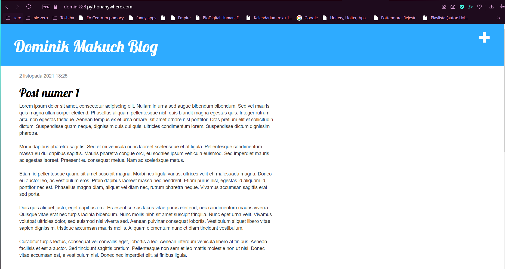
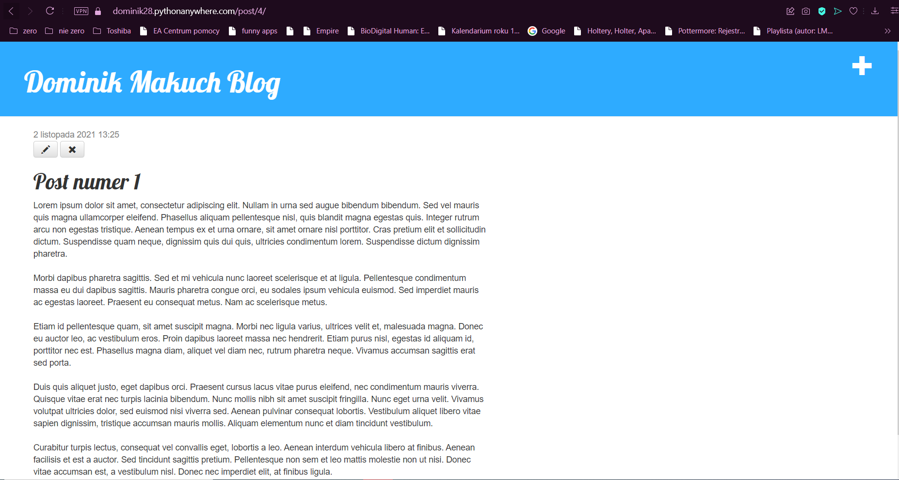
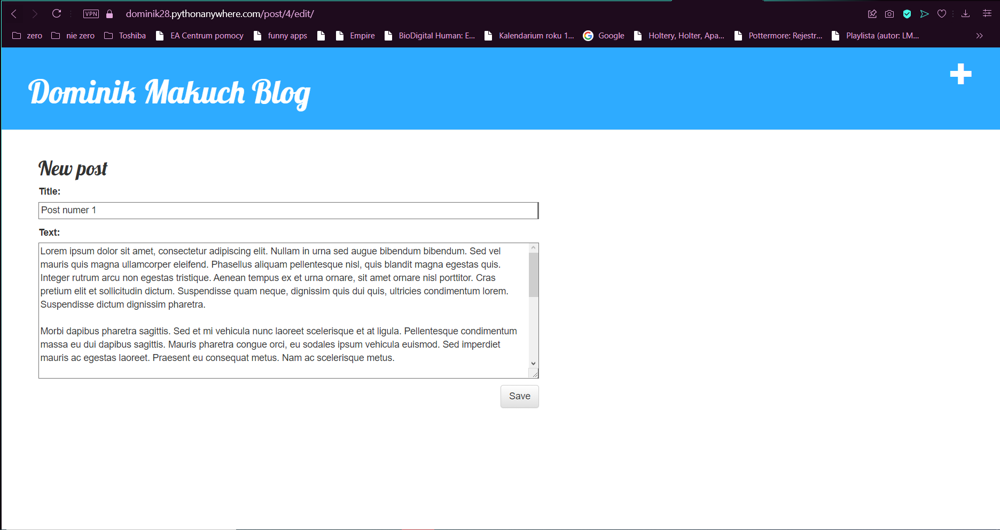
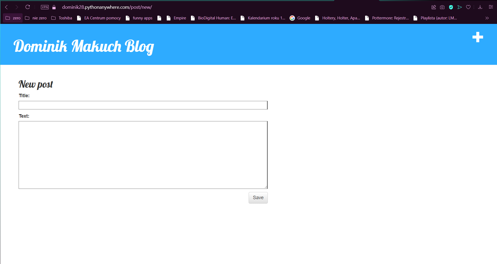
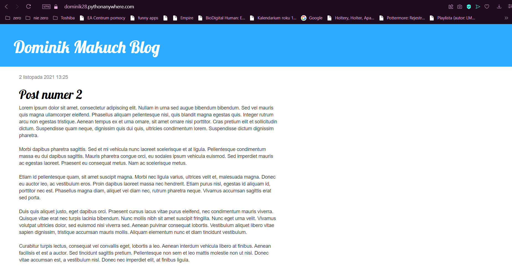
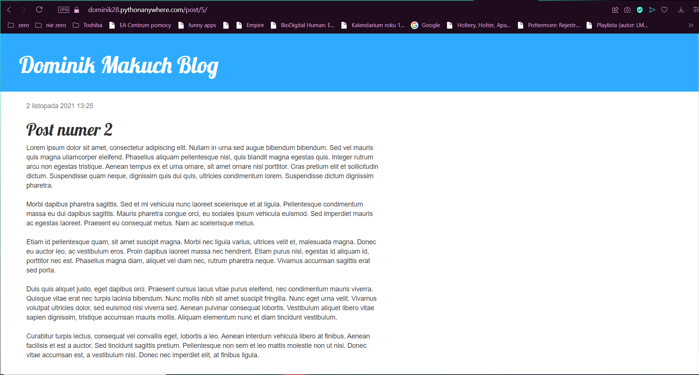

# Projekt 1 - Blog Django

* Na stronie startowej można zobaczyć wszystkie dodane dotychczas posty.

* Po wciśnięciu jakiegokolwiek posta pojawia się szczegółowy widok tego posta wraz z możliwością przejścia do widoku edycji jak i możliwością usunięcia posta.

* Widok edycji posta umożliwia zmianę zawartości jak i tytułu wybranego posta.

* Po wciśnięciu przycisku "+" w prawym górnym rogu strony zostaniemy przeniesieni do widoku dodawania nowego posta.

* Po wylogowaniu się z konta administratora znika możliwość dodawania nowych postów, edycji istniejących oraz ich usuwania.

