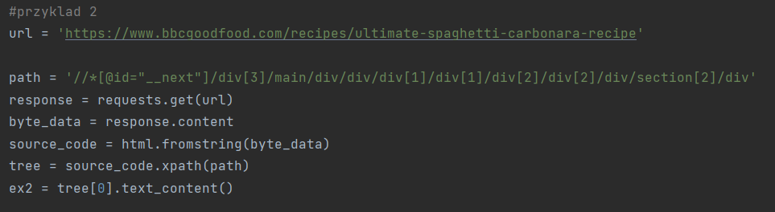

# Stworzyłem aplikację w Django pozwalającą na web scraping wybranych stron internetowych:

 Wyszukiwanie wybranego elementu na wybranej stronie internetowej.

Po podaniu w formularzu adresu strony internetowej oraz nazwy elementu ('np. "div", "p", itp.) wyświetlone zostaną wszystkie podane elementy.

Jako przykład podałem moją ulubioną stronę internetową oraz wyszukałem element 'body'.

Po wybraniu opcji "wyszukaj" wyświetlana jest informacja na temat znalezionego elementu.
W tym przypadku element "body" zawiera jedynie tekst.

Kolejna zakładka umożliwia wyszukiwanie elementów na wybranej stronie internetowej za pomocą ID danego elementu.

Jako adres strony internetowej podałem stronę Wikipedi na temat "Web Scrapeingu". Jako ID elementu podałem "content" po wcześniejszym zbadaniu kodu źródłowego strony znalazłem element "div" o ID "content".

Po wciśnięciu przycisku wyszukaj wyświetlana jest zawartośc elementu DIV o ID "content".

Kolejna zakładka pozwala na wyszukiwanie elementu na podanej stronie który należy do podanej klasy.

Jako stronę wybrałem moją drugą ulubioną witrynę na której wyszukuję element "div" o klasie "inner-content".

Jak widać znaleziono 22 elementy div o klasie inner-content.

Ostatnia zakładka wyświetla wyniki pobrane z różnych stron internetowych za pomocą "Beautiful Soup", "lxml" oraz "XPath".
Powyżej znajduje się zrzut ekranu wyniku pobranego ze strony "zacniewski.github.io/about/" a konkretnie zawartości wybranego przeze mnie elementu "div".

Powyżej znajduje się kod zawarty w pliku "views.py" odpowiedzialny za pobranie powyższego wyniku.
Poprzez zbadanie kodu źródłowego strony skopiowałem "XPath" do interesującego mnie div'a po czym do zmiennej "byte_data" zapisywane są dane w postaci bajtów które następnie zapisywane są do zmiennej "source_code" po sparsowaniu. Po czym tworzona jest lista za pomocą ".xpath()" a interesujące mnie informacje są na pierwszym miejscu tej listy.

W analogiczny sposób pobierany jest przepis na spaghetti.

W kolejnym przykładzie ze strony sprzedającej firany pobierane jest pierwsze 20 (ze względu na dużą liczbę produktów) wyników zawierających nazwę firany oraz jej opis.

Za pomocą Beautiful Soup parsowana jest zawartość strony z firanami po czym tworzona jest lista elementów div które zawierają interesujące mnie informacje a następnie w pętli pobierane są kolejne nazwy oraz opisy produktów.

W ostatnim przykładzie pobieram ze strony w3schools.com całą zawartość sekcji "head".

